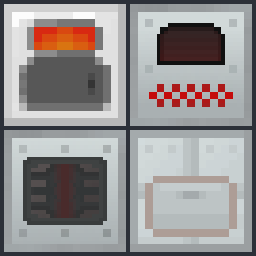

<div align="center">



# IndustrialCraft 2 — NeoForge 1.21.1 非官方移植版

**Unofficial NeoForge 1.21.1 Port of IndustrialCraft 2**


</div>

---

> ## ⚠️ 声明 · DISCLAIMER（先看这里）
>
> ### 🤖 本项目由纯 AI 打造
>
> 本仓库的**全部**迁移、修复、适配与文档编写工作均由大语言模型（AI）在人工监督下完成，  
> 代码**未经人工逐行审查**。使用本模组可能遇到未知的崩溃、存档损坏或平衡性问题。  
> **请务必在用于长期存档前做好备份。**
>
> ### ⚖️ 非官方移植 · 版权边界
>
> 本项目是 **IndustrialCraft 2** 的**非官方** NeoForge 1.21.1 移植版。  
> **原作版权归 IC2 Dev Team 所有**。本仓库代码主体来源于对原作的反编译  
> （IC2 2.9.162 / MC 1.19.2，辅以 IC2 2.8.221 / MC 1.12.2 作权威对照），  
> 仅供**学习与研究**使用。
>
> - **本项目不附带开源许可证（All Rights Reserved）**：你可以下载、游玩、研究本仓库的代码；  
>   未经允许**不得**将本项目用于商业用途，或再发布到其他平台。
> - 若原作方对本项目提出权利主张，本项目将立即配合处理（包括但不限于下架）。
>
> ---
>
> ### 🤖 Built Entirely by AI
>
> Every part of this port — migration, bug-fixing, adaptation and documentation — was produced by  
> large language models under human supervision. **The code has not been reviewed line-by-line by a human.**  
> Expect unknown crashes, world corruption or balance issues. **Back up your worlds before use.**
>
> ### ⚖️ Unofficial Port · Copyright
>
> This is an **unofficial** NeoForge 1.21.1 port of **IndustrialCraft 2**.  
> All rights to the original work belong to the **IC2 Dev Team**. The code in this repository is derived  
> from decompilation of the original mod (IC2 2.9.162 / MC 1.19.2, with IC2 2.8.221 / MC 1.12.2 as the  
> authoritative reference) and is provided **for learning and research purposes only**.
>
> - **No open-source license is attached (All Rights Reserved)**: you may download, play and study this  
>   code; you may **not** use it commercially or redistribute it to other platforms without permission.
> - If the original rights holders raise any claim, this project will comply immediately  
>   (including takedown if required).

---

## 📖 这是什么 · What is this

**IndustrialCraft 2（工业时代 2）** 是 Minecraft 历史上最具影响力的科技类模组之一：以 EU（能量单位）  
为核心的发电、输电、储能与用电体系，全套加工机器，核电与反应堆，电动装备，作物杂交等。

原作的最新官方版本停留在 Minecraft 1.19.2（Forge）。**本项目将其完整迁移到了 Minecraft 1.21.1（NeoForge）**。

迁移以 IC2 2.9.162（MC 1.19.2）的反编译产物为起点，以 IC2 2.8.221（MC 1.12.2）为权威语义对照，  
经过 **40+ 轮** 系统性修复，覆盖网络通信、物品 NBT、能源系统、GUI、成就、资源数据等全部模块，  
目前已达到可游玩的公开测试状态。

**IndustrialCraft 2** is one of the most influential tech mods in Minecraft history: the EU (Energy Unit)  
system for power generation, transmission, storage and consumption, a full suite of processing machines,  
nuclear reactors, electric gear, crop breeding and more.

The latest official release targets Minecraft 1.19.2 (Forge). **This project ports it to Minecraft 1.21.1 (NeoForge)**,  
starting from decompiled IC2 2.9.162 and cross-checked against IC2 2.8.221 (MC 1.12.2) as the authoritative reference,  
through 40+ rounds of systematic fixes covering networking, item NBT, the energy system, GUIs, advancements and data assets.

---

## ✨ 特性 · Features

- ⚡ **完整 EU 能源体系**：火力/太阳能/风力/水力/核电发电，电缆与变压器输配电，  
  BatBox / CESU / MFE / MFSU 分级储能
- 🏭 **全套加工机器**：打粉机、电炉、压缩机、提取机、装配机、金属成型机、感应炉等
- 🔋 **分级电池与充电设备**：RE 电池 → 高级电池 → 能量水晶 → 兰波顿水晶，含充电垫
- 🛠️ **电动装备**：电钻、电锯、采矿激光、纳米护甲、量子护甲、喷气背包（流体燃料 + 电动）
- ☢️ **核反应堆**：完整组件热量/冷却模拟
- 🌱 **作物杂交**：全套作物架与种子属性系统
- 📦 **其他**：UU 物质与物质生成机、传送器、扫描器、量子头盔夜视、染色量子套等
- 🧩 **JEI 兼容**（可选，v19+）：配方查看集成

---

## 📥 安装 · Installation

| 需求           | 版本                      |
| ------------ | ----------------------- |
| Minecraft    | **1.21.1**              |
| NeoForge     | **21.1.x**（实测 21.1.244） |
| JEI（可选，仅客户端） | 19.x                    |

1. 安装 Minecraft 1.21.1 + NeoForge 21.1.x；
2. 将本模组 jar（[Releases](../../releases) 页下载）放入 `.minecraft/mods/`；
3. （可选）安装 JEI 19.x 以查看配方；
4. 启动游戏即可。

> ⚠️ **alpha 阶段提醒**：建议先用测试存档游玩，确认稳定后再用于长期存档。

---

## 🔨 从源码构建 · Build from Source

需要 **JDK 21**。

```bash
# Windows
gradlew.bat build

# Linux / macOS
./gradlew build
```

产物位于 `build/libs/ic2-2.9.162.jar`。

> 构建脚本使用官方 ModDevGradle 2 模板（MDK 1.21.1），首次构建会下载 NeoForge 与映射数据，  
> 耗时较长属正常现象。

---

## 🐛 已知问题 · Known Issues

当前为 **alpha 公开测试版**，以下为如实记录的已知限制：

- **UU 物质相关**：`mass_fabricator` / `uu_matter` 的物品形态与流体形态并行存在，后续版本可能调整；  
  其对应成就（`acquireMatter`）的判定目前绑定物品形态。
- 部分生僻路径（个别升级模块组合、罕见机器交互）尚未完成端到端实测。
- 如遇到崩溃或异常行为，请到 [Issues](../../issues) 反馈，并附上 `logs/latest.log`。

---

## 🗺️ 路线图 · Roadmap

- [ ] 完成 UU 物质形态的统一决策与调整
- [ ] 全量玩法回归测试（生存模式全流程）
- [ ] 修复实测中发现的新问题
- [ ] 视情况补齐成就触发条件
- [ ] 进入 beta：稳定性优先，版本号进入 0.x.y
- [ ] 未来有可能会考虑一次性往26.x或更高同步，如果我正在玩的其他模组也有重大更新的话

---

## ⚙️ 开发说明 · About the Development

本项目是一次"AI 全程驾驶"的模组迁移实验，供社区参考：

| 维度        | 说明                                             |
| --------- | ---------------------------------------------- |
| 代码规模      | 1,122 个 Java 源文件，5,182 个资源文件                   |
| 迁移起点      | IC2 2.9.162（MC 1.19.2）CFR 反编译，SRG → Mojmap 反混淆 |
| 权威对照      | IC2 2.8.221（MC 1.12.2）源码与资源，逐项语义比对             |
| 修复轮次      | 40+ 轮，每轮均有交接文档与字节码级复核（javap）                   |
| 关键 API 依据 | NeoForge 1.21.x 官方文档与迁移指南、AE2 19.x 实证对照        |
| 构建体系      | ModDevGradle 2 + Gradle 9 + JDK 21             |

---

## 🙏 版权与致谢 · Copyright & Credits

- **IndustrialCraft 2** —— 原作 © **IC2 Dev Team**。本作所拥有的一切乐趣都源于他们十余年的创作。  
  原作者与官方站点：<https://www.industrial-craft.net/>
- **移植与维护** —— **Mordred1027**（全部迁移、修复与文档工作由 AI 完成，人工负责需求、测试与验收）。
- **NeoForge** —— 现代化的模组加载器与 API。
- **Applied Energistics 2 (AE2)** —— 迁移过程中用作 NeoForge 1.21 API 范式的实证参照。

---

<div align="center">

**如果这个项目帮到了你，欢迎 ⭐ Star 支持。**

</div>
